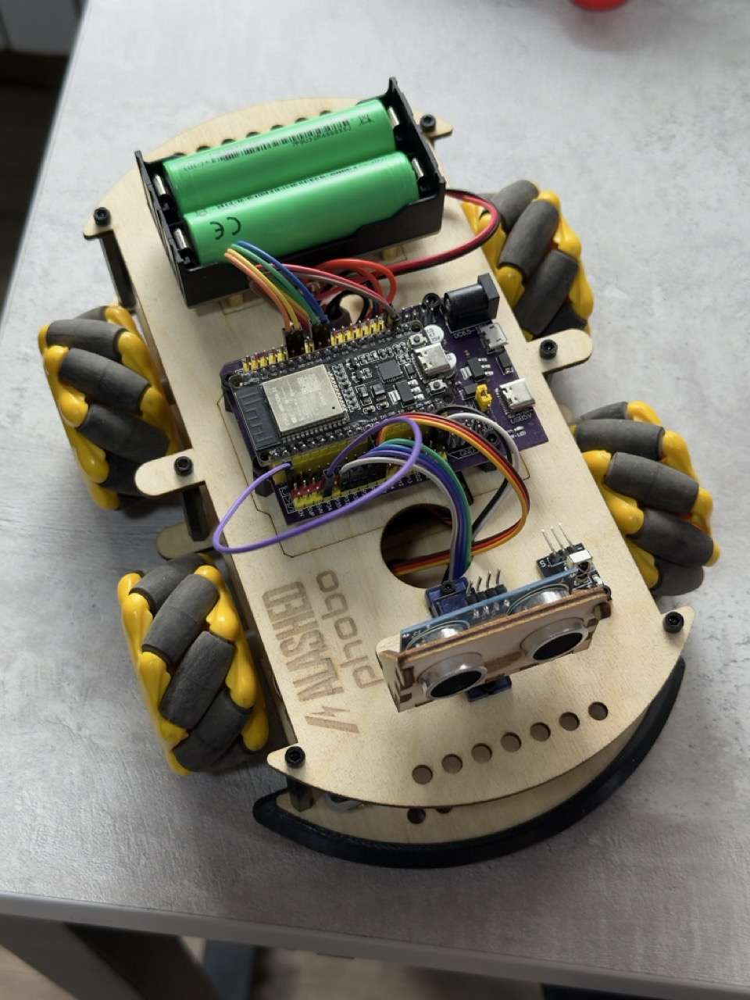

# ESP32 Omni-Directional Robot Controller

ESP32-based controller for a 4-wheel omni-directional robot with X-configuration drive system. Features multiple control methods: Wiimote, Web interface, and Web Bluetooth.



## 3D Model

**[View Interactive 3D Model on Autodesk 360](https://mystu28259.autodesk360.com/shares/public/SH28cd1QT2badd0ea72bc6be23fc66090b41?mode=embed)**

[](https://mystu28259.autodesk360.com/shares/public/SH28cd1QT2badd0ea72bc6be23fc66090b41?mode=embed)

## Features

- **4-Motor X-Configuration**: Omni-directional movement (forward/backward/strafe/rotate)
- **Multiple Control Modes**: Wiimote, Web interface, or Web Bluetooth
- **Two Drive Modes**:
  - Omni Mode: Joystick X-axis controls strafing
  - Tank Mode: Joystick X-axis controls rotation
- **Motor Calibration**: Web-based interface for motor mapping and direction inversion
- **Persistent Configuration**: Settings saved to ESP32 NVS (EEPROM)

## Hardware

### Components
- ESP32 development board
- 4× DC motors with omni wheels
- 2× TA6586 dual H-bridge motor drivers
- Power supply for motors

### Motor Layout
```
    M1 ↗  ↖ M2
        ╲╱
        ╱╲
    M3 ↙  ↘ M4
```

### Pinout
- **Driver 1 (Motors 1 & 2)**: GPIO 32,33,25,26
- **Driver 2 (Motors 3 & 4)**: GPIO 19,18,17,16

## Branches

### `main` - Wiimote Control
Nintendo Wii Remote control via Bluetooth Classic.

**Controls (Horizontal Orientation)**:
- D-Pad LEFT/RIGHT: Forward/Backward
- D-Pad UP/DOWN: Strafe Left/Right
- Button A/2: Rotate Right
- Button B/1: Rotate Left
- PLUS/MINUS: Increase/Decrease speed
- HOME: Emergency stop

### `web-bluetooth-control` - Web Bluetooth
Browser-based control using Web Bluetooth API. No WiFi setup required.

**Features**:
- Progressive Web App hosted on GitHub Pages
- Joystick and button control modes
- Real-time motor calibration
- Works on Chrome/Edge (Android, Windows, macOS, Linux)

**Live Demo**: https://asdasddasd-wheat.vercel.app/

### `wifi-control` - WiFi Web Interface
Web interface served directly from ESP32 over WiFi.

**Features**:
- Connect to WiFi network
- Access web interface at ESP32's IP address
- Responsive design for mobile/desktop
- Motor calibration tab

## Quick Start

### Build and Upload

```bash
# Build the project
pio run

# Upload to ESP32
pio run --target upload

# Monitor serial output
pio device monitor
```

### Using Different Branches

```bash
# Wiimote control (main branch)
git checkout main
pio run --target upload

# Web Bluetooth control
git checkout web-bluetooth-control
pio run --target upload

# WiFi control
git checkout wifi-control
pio run --target upload
```

## Drive Modes

**Omni Mode (Default)**:
- Forward/Backward: All motors same direction
- Strafe Left/Right: Motors move in X-pattern
- Joystick X-axis: Strafe sideways

**Tank Mode**:
- Forward/Backward: All motors same direction
- Rotate Left/Right: Motors oppose each other
- Joystick X-axis: Rotate in place

Switch modes via command or web interface. Setting persists across reboots.

## Motor Calibration

All branches support motor calibration to correct for:
- Incorrect motor wiring
- Motors spinning wrong direction
- Non-standard motor arrangement

**Calibration Process**:
1. Test each motor individually
2. Map logical positions (0-3) to physical motors (1-4)
3. Invert motor direction if needed
4. Save configuration to EEPROM

## Configuration

Default settings in `src/main.cpp`:
- PWM Frequency: 5000 Hz
- PWM Resolution: 8-bit (0-255)
- Default Speed: 200
- Speed Range: 50-255

For WiFi branch, update credentials:
```cpp
const char* ssid = "YourWiFi";
const char* password = "YourPassword";
```

## Technical Details

### TA6586 H-Bridge Driver
The TA6586 requires inverted PWM for backward motion:
- **Forward**: D0 = PWM, D1 = LOW
- **Backward**: D0 = (255 - PWM), D1 = HIGH

### Motor Control Layers
1. **Physical Motors**: Hardware control with TA6586 logic
2. **Logical Motors**: User-configured mapping and inversion
3. **Movement Functions**: High-level kinematics

### X-Configuration Kinematics

**Omni Mode**:
- Forward: M1+, M2+, M3+, M4+
- Strafe Left: M1-, M2+, M3+, M4-
- Rotate Left: M1-, M2+, M3-, M4+

**Tank Mode**:
- Forward: M1+, M2+, M3+, M4+
- Rotate Left: M1-, M2+, M3-, M4+

## Dependencies

- PlatformIO
- ESP32 Arduino Core
- Branch-specific:
  - `main`: ESP32Wiimote library
  - `web-bluetooth-control`: ESP32 BLE Arduino (built-in)
  - `wifi-control`: ESPAsyncWebServer, AsyncTCP

## Browser Support (Web Bluetooth Branch)

**Supported**:
- Chrome 56+ (Android, Windows, macOS, Linux)
- Edge 79+ (Windows, macOS)

**Not Supported**:
- iOS Safari (no Web Bluetooth API)

**iOS Workaround**: Use [Bluefy Browser](https://apps.apple.com/app/bluefy-web-ble-browser/id1492822055)

## Troubleshooting

### Motors not responding
- Check power supply to motors
- Verify pin connections match configuration
- Test motors individually via calibration

### Wiimote won't connect
- Press 1+2 buttons on Wiimote to enter pairing mode
- Check serial monitor for connection status
- Ensure Wiimote batteries are charged

### Web Bluetooth not working
- Must use Chrome or Edge browser
- Requires HTTPS connection
- Check browser console for errors

### Motors spinning wrong direction
- Use calibration interface to invert motor direction
- Save configuration to EEPROM

## License

This project is open source. See individual files for license information.

## Contributing

1. Fork the repository
2. Create a feature branch
3. Make your changes
4. Submit a pull request

## Additional Documentation

See `CLAUDE.md` for detailed technical documentation and development guidelines.
